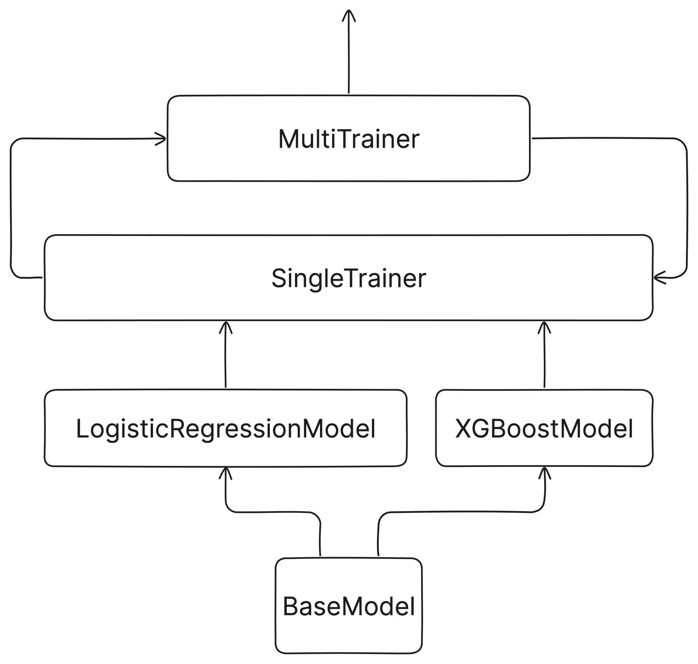

# Fraud Prediction Documentation

## Problem Statement

The goal is to develop a robust fraud detection system that can accurately identify fraudulent credit card transactions while ensuring interpretability. The dataset contains over 550,000 transaction records with anonymized features representing transaction characteristics. The challenge includes both detecting fraud and explaining why a transaction was classified as fraudulent.

## Dataset

Source: [Kaggle-Credit Card Fraud Detection Dataset 2023](https://www.kaggle.com/datasets/nelgiriyewithana/credit-card-fraud-detection-dataset-2023)
This dataset contains credit card transactions made by European cardholders in the year 2023. It comprises over 550,000 records, and the data has been anonymized to protect the cardholders' identities. The primary objective of this dataset is to facilitate the development of fraud detection algorithms and models to identify potentially fraudulent transactions.

## Directory structure

The project is organized as follows:

```bash
.
├── README.md               # Project overview and instructions
├── document.md             # Documentation for the project
├── requirements.txt        # Dependencies for the project
├── data/
│   ├── raw/                # Raw dataset
│   │   ├── dataset.csv     # Original dataset
│   │   ├── dataset.parquet # Parquet format dataset
├── notebooks/
│   ├── EDA.ipynb           # Exploratory Data Analysis
│   ├── main.ipynb          # Main Jupyter Notebook for modeling
├── reports/
│   ├── EDA.pdf             # EDA summary report
│   ├── main.pdf            # Final report
│   ├── plots/              # Generated plots for analysis
│   │   ├── Amount-hist.png
│   │   ├── Class-hist.png
│   │   ├── Feature-histograms...
├── models/
│   ├── model_1.pkl         # Trained model - Logistic Regression
│   ├── model_2.pkl         # Trained model - XGBoost
├── src/
│   ├── __init__.py
│   ├── config.py           # Configuration file
│   ├── data/
│   │   ├── __init__.py
│   │   ├── data_processor.py # Data processing functions
│   │   ├── dataloader.py     # Data loading functions
│   ├── models/
│   │   ├── __init__.py
│   │   ├── base_model.py   # Base model class
│   │   ├── logistic_regression_model.py # Logistic Regression
│   │   ├── multi_trainer.py # Main model training class
│   │   ├── single_trainer.py # Model training class
│   │   ├── xgboost_model.py # XGBoost model
│   ├── utils/
│   │   ├── csv_to_parquet.py # CSV to Parquet conversion utility
├── venv/                   # Virtual environment
```

## Setup

```bash
# Create Virtual Environment
python -m venv venv
source venv/bin/activate  # macOS/Linux
# venv\Scripts\activate  # Windows
pip install -r requirements.txt

# Register Kernel for Jupyter Notebook
python -m ipykernel install --user --name=venv --display-name "Python (venv)"
```

> Use `venv` as the virtual environment because it is specifically designated for this project, unlike `conda` which is a general-purpose environment manager.

## Approach

- **PEP** coding style is followed.
  - **Type hints** are used for function arguments and return types.
  - **Docstrings** are provided for functions and classes.
- **PyTorch** file naming convention is used.
- Attempt to **pipeline** the process (inspired by AutoGluon).
- **Data Storage**: Data is stored in `.parquet` format for optimal performance and efficient retrieval.

### 1. Exploratory Data Analysis (EDA)

- **Dataset Overview**
  - 568,630 records, 30 features, and 1 target variable.
  - Ratio **8:1:1(~55k) ratio** is maintained.
  - **Train: Validation: Test** = **80:10:10** → **440k: 55k: 55k**

- **Data Quality**
  - No missing values → No imputation required.

- **Target Variable**
  - Binary classification: **0 = Non-fraudulent, 1 = Fraudulent**
  - Class balance (equal distribution).

- **Feature Analysis**
  - All features have **high cardinality** (`nunique` values) and feature name is secret.
    - Treated as **numerical** variables.
  - Presence of **some outliers**.
    - The function **`cut_outliers()`** removes outliers based on quantile thresholds.
    - The threshold is set to **100 records (50 × 2) from 500k** to handle human errors and other anomalies.
    - Act as safeguards to prevent extreme values from affecting the model.
    - Cut directly from the dataset in small batches does not affect the performance of the model. (see *Appendix*)

- **Feature Distribution**
  - **Approximately Gaussian** → Consider **linear models** as one of the modeling approaches.
  - **Multimodal distribution** → Consider **tree-based models** as an alternative approach.

### 2. Data Preprocessing

- **Drop the ID feature** as it is not useful in this case.
- **Initial split**: dataset → train (80+10%) | test (10%)
  - to avoid **data leakage**.
  - `src.DataProcessor.initial_train_test_split()`
- **Normalization** and scaling of features.
  - Helps the model **converge** faster.
  - `src.DataProcessor.normalize()`
  - **StandardScaler** is used to scale the features because data is approximately Gaussian. (even if it is not, but still better than MinMaxScaler)
- `src.dataloader` module for loading data.
  - `optimize_memory_usage()` Optimizes the memory usage of a pandas DataFrame by converting columns to the smallest possible data types.
  - `load_data()`, and `save_data()` functions.
    - With `.parquet` and `.csv` support.
    - Automatic timestamp-based file naming convention (e.g., `2025-01-01-data.parquet`).
    - Supports multiple `OS`-specific paths and folder structures.

### 3. Model Development

- Training multiple machine learning models such as:
  - Binary Classification Problem.
  - Logistic Regression: Linear model.
  - XGBoostCls: Tree-based model.
  - etc.
- Performing hyperparameter tuning for optimal performance.
  - **Bayesian optimization** using `optuna`.
- Class Design:
  - Inspired by `PyTorch Lightning`.
  - `SingleTrainer` for single model training with hyperparameter tuning.
  - `MultiTrainer` for training multiple models in single run.
  - 
  - Global configuration `config.py`: , `Config` class., `Config.SEED=42` for reproducibility, and plotting style.

### 4. Model Evaluation

- Main metric: **Recall**.
  - The goal is to detect as many fraudulent (**positive class**, 1) transactions as possible.
  - In real-world scenarios, data is **extremely imbalanced**, making it crucial to identify fraudulent transactions effectively. So, we need to focus on **recall**.
  - Why not money-weighted recall?
    - Money-weighted recall = TP_amount / (TP_amount + FN_amount)
    - because it will give higher weight to the higher amount of money and lower weight to the lower amount of money. But in real-world scenarios, low amount of money but affect many people can cause a big problem.
  - Why not expected-cost?
    - Expected cost = FN_amount + FP_operation_cost
    - because it is not easy to calculate the cost of the operation.
- Using other appropriate evaluation metrics such as:
  - Precision, Recall, F1-score, and ROC-AUC.
  - to measure model effectiveness in other aspects.
- Avoiding issues like overfitting and underfitting.
  - Using **Stratified K-Fold Cross-Validation**, 5 folds for robust model evaluation.
  - Splitting the dataset into train, validation, and test sets to prevent data leakage (overfitting).
  - **Early stopping** to prevent overfitting.(default=10)

### Future steps

- Model Interpretability
  - Using game theory approach, SHAP (SHapley Additive exPlanations) values to interpret model decisions.
  - Explaining why a transaction is classified as fraudulent.
- Model Diversity
  - Running multiple models to ensure robustness.
  - Ensemble methods to combine multiple models for better performance. (e.g., 2-stage ensemble Recall-Precision model)
- Model Training
  - **Parrallel** training of multiple models and hyperparameter tuning.
  - GPU support for faster training.
- Prediction file generation
  - Does not implement yet because it is not required in the current task, look at metrics and model performance is enough.
- Model deployment

## Author

- [Pupipat Singkhorn](https://github.com/pupipatsk), February 17, 2025.
- Some source code is from [https://github.com/pupipatsk/Data-Science.git](https://github.com/pupipatsk/Data-Science.git)

## Appendix

```
Not Cut Outliers - Results
{'train': {'LogisticRegression': {'precision': 0.9778115953085538,
   'recall': 0.9516929546200622,
   'f1': 0.9645754981353962,
   'accuracy': 0.9650485474835228,
   'roc_auc': 0.9935839474162925},
  'XGBoost': {'precision': 0.99997655242487,
   'recall': 1.0,
   'f1': 0.9999882760749862,
   'accuracy': 0.9999882759146252,
   'roc_auc': 0.9999999995876375}},
 'test': {'LogisticRegression': {'precision': 0.9765972046661129,
   'recall': 0.951109704196124,
   'f1': 0.9636849607982894,
   'accuracy': 0.9641594710092679,
   'roc_auc': 0.993271341982931},
  'XGBoost': {'precision': 0.9994726850875343,
   'recall': 1.0,
   'f1': 0.9997362730101799,
   'accuracy': 0.9997362080790673,
   'roc_auc': 0.9999849842306959}}}
```

```
Cut Outliers - Results
{'train': {'LogisticRegression': {'precision': 0.9778115953085538,
   'recall': 0.9516929546200622,
   'f1': 0.9645754981353962,
   'accuracy': 0.9650485474835228,
   'roc_auc': 0.9935839474162925},
  'XGBoost': {'precision': 0.99997655242487,
   'recall': 1.0,
   'f1': 0.9999882760749862,
   'accuracy': 0.9999882759146252,
   'roc_auc': 0.9999999995876375}},
 'test': {'LogisticRegression': {'precision': 0.9765972046661129,
   'recall': 0.951109704196124,
   'f1': 0.9636849607982894,
   'accuracy': 0.9641594710092679,
   'roc_auc': 0.993271341982931},
  'XGBoost': {'precision': 0.9994726850875343,
   'recall': 1.0,
   'f1': 0.9997362730101799,
   'accuracy': 0.9997362080790673,
   'roc_auc': 0.9999849842306959}}}
```
